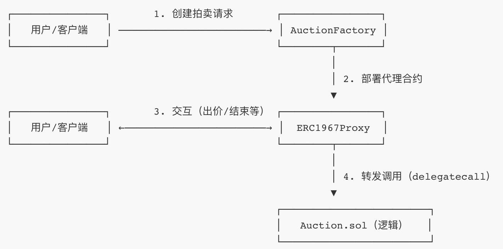
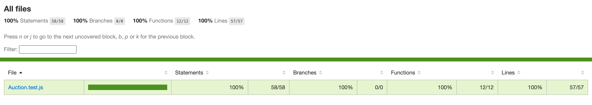
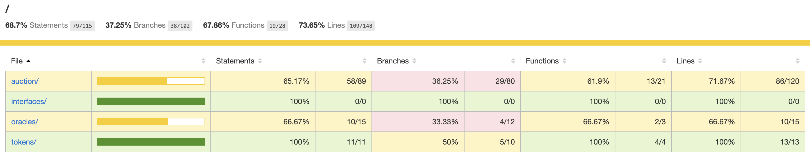
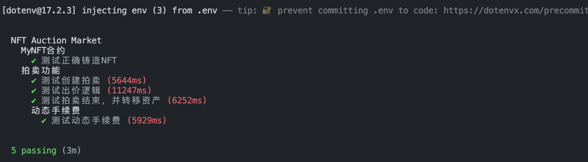
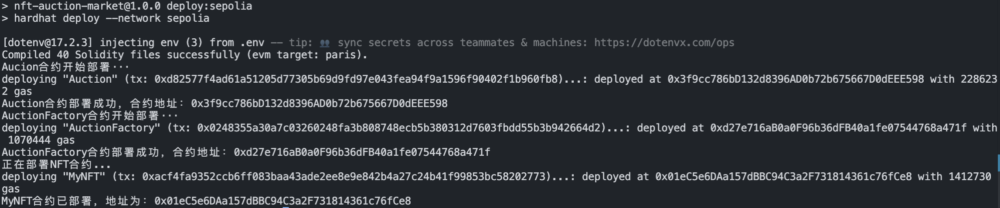

# NFT 拍卖市场项目文档

## 项目概述

本项目是一个基于以太坊区块链的 NFT 拍卖市场，支持 NFT 的创建、拍卖、出价和结算等核心功能。项目采用 Hardhat 开发框架，结合 OpenZeppelin 合约库，实现了安全可靠的 NFT 拍卖机制。

## 项目结构

```
nft-auction-market/
├── artifacts/                      # 合约编译产物（ABI和字节码）
├── cache/                          # 编译缓存
├── contracts/                      # 智能合约源代码
|   ├── auction/                    # 拍卖相关合约
|   |   ├── Auction.sol             # 拍卖合约
|   |   └── AuctionFactory.sol      # 拍卖工厂合约
|   ├── interfaces/                 # 接口合约
|   |   ├── IAuction.sol            # 拍卖接口
|   |   └── IAuctionFactory.sol     # 拍卖工厂接口
|   ├── oracles/                    # 预言机
|   |   └── PriceConverter.sol      # NFT合约
|   └── tokens/                     # 代币
|       └── MyNFT.sol               # NFT合约
|       
├── deploy/                 # 部署脚本
│   ├── deploy_nft.js       # NFT合约部署脚本
│   └── deploy_auction.js   # 拍卖及工厂合约部署脚本
├── test/                   # 测试文件
│   └── Auction.test.js     # 拍卖功能测试
├── hardhat.config.js       # Hardhat配置文件
├── package.json            # 项目依赖配置
└── .env                    # 环境变量（不纳入版本控制）
```

## 核心功能说明

1. **NFT 管理**

- - 支持 NFT 的铸造

- - 实现 NFT 元数据管理

1. **拍卖功能**

- - 创建拍卖（设置起拍价、拍卖时长）

- - 拍卖出价（支持多次出价，自动更新最高价）

- - 拍卖结算（结束后自动转移 NFT 和资金）

1. **拍卖工厂**

- - 统一管理拍卖合约

- - 简化拍卖创建流程

## 环境准备

### 前置依赖

- Node.js (v14+)

- npm 或 yarn

- Hardhat

### 环境变量配置

创建.env文件，添加以下环境变量：

```
INFURA_API_KEY=.......
PRIVATE_KEY=.......
ETHERSCAN_API_KEY=.......
```

## 部署步骤

### 1. 项目初始化

```bash
# 初始
# 1. 创建项目文件夹并进入（自定义文件夹名，这里用 nft-auction-market）
mkdir nft-auction-market && cd nft-auction-market

# 2. 初始化 npm 项目（-y 表示默认配置，无需手动确认）
npm init -y
# 执行后生成 package.json 文件，用于管理项目依赖

# 3. 安装 Hardhat 2 核心包（指定版本 2.17.0，稳定且兼容）
npm install --save-dev "hardhat@^2.17.0"

# 4. 初始化 Hardhat 项目（选择 JavaScript 模板）
npx hardhat init
```

### 2. 编译合约

```bash
# 1. 安装 Hardhat 工具包（包含测试、部署、交互所需的核心工具）
# @nomiclabs/hardhat-waffle：Hardhat 2 的核心插件集
# ethereum-waffle + chai：测试框架和断言库
# @nomiclabs/hardhat-ethers + ethers：与以太坊交互的工具 简单部署和测试
npm install --save-dev @nomiclabs/hardhat-waffle@2.0.6 ethereum-waffle@3.4.4 chai@4.3.7 @nomiclabs/hardhat-ethers@2.2.3 ethers@5.7.2

# 更强大的合约部署管理能力：复杂的部署流程管理
npm install --save-dev hardhat-deploy

# 安装 Ethers.js 适配器（如果用 Ethers）
npm install --save-dev @nomiclabs/hardhat-ethers ethers
# hardhat.config.js
require("@nomiclabs/hardhat-ethers"); # 必须在 hardhat-deploy 之前引入
require("hardhat-deploy"); # 关键：启用 deploy 任务

# 2. 安装合约验证插件（用于在 Etherscan 上公开合约源码）
npm install --save-dev @nomiclabs/hardhat-etherscan

# 3. 安装环境变量管理工具（安全存储私钥、API Key 等敏感信息）
npm install --save-dev dotenv

# 4. 安装代码格式化工具（统一代码风格，避免语法错误）
npm install --save-dev prettier prettier-plugin-solidity

# 5. 安装预言机
npm install @chainlink/contracts

# 6. 安装合约升级相关依赖
npm install @openzeppelin/contracts-upgradeable

# 7. 安装基础合约相关依赖
npm install @openzeppelin/contracts

# 8.安装两个用于区块链测试的关键工具，专门解决 Hardhat 测试中 “断言逻辑” 的问题，让你能更方便地验证合约行为是否符合预期。
npm install --save-dev chai @nomicfoundation/hardhat-chai-matchers

# 9.用 nyc（Istanbul）直接跑覆盖测试（最通用）
npm install --save-dev nyc @istanbuljs/nyc-config-typescript
# 在 package.json 中添加脚本
{
  "scripts": {
    "test": "hardhat test",
    "test:coverage": "nyc hardhat test" // 新增覆盖测试脚本
  },
  "nyc": {
    "extends": "@istanbuljs/nyc-config-typescript",
    "include": ["test/**/*.test.js"], // 测试文件路径
    "exclude": ["node_modules/**"],
    "reporter": ["text", "html"] // 输出格式：终端文本 + HTML 报告
  }
}

# 10.solidity-coverage精准统计 .sol 覆盖率的工具
npm install --save-dev solidity-coverage
# 修正 hardhat.config.js 配置（关键解决分叉问题）
require("solidity-coverage");
require("dotenv").config();

module.exports = {
  solidity: "0.8.20", // 与你的合约版本一致
  networks: {
    hardhat: {
      forking: {
        url: `https://mainnet.infura.io/v3/${process.env.INFURA_API_KEY}`, // 主网 RPC
        enabled: true, // 强制启用分叉
        blockNumber: 19000000, // 固定区块号（确保稳定）
      },
    },
  },
  // 强制覆盖率测试使用 hardhat 网络（带分叉）
  coverageNetwork: "hardhat",
  // 延长超时时间（避免分叉操作超时）
  mocha: {
    timeout: 600000, // 10分钟
  },
};
# 在 package.json 中添加脚本
{
  "scripts": {
    "test": "hardhat test",
    "coverage": "hardhat coverage" // 专门用于 Solidity 覆盖率测试
  }
}


```
### 工厂合约、代理合约、逻辑合约的关系及交互流程


### 3. 编译、测试、部署

```bash
# 编译合约
npm run compile

# 测试
npm run test

# 覆盖率测试
npm run test:coverage

# 覆盖率：sol文件的覆盖率
npm run coverage

# 部署到测试网
npm run deploy:sepolia
```

## 测试报告

### 测试覆盖率

**
一、JS测试文件的覆盖率测试：


- 整体覆盖率：100%

- 分支覆盖率：100%

- 语句覆盖率：100%

二、Solidity测试文件的覆盖率测试：


### 测试结果

**



- 总测试用例：5 个

- 通过：5 个

- 失败：0 个

- 跳过：0 个

## 已部署合约地址（Sepolia 测试网）



- **MyNFT 合约**：0x01eC5e6DAa157dBBC94C3a2F731814361c76fCe8

- **Auction 合约**：0x3f9cc786bD132d8396AD0b72b675667D0dEEE598

- **AuctionFactory 合约**：0xd27e716aB0a0F96b36dFB40a1fe07544768a471f 


## 技术栈

- **智能合约**：Solidity 0.8.20

- **开发框架**：Hardhat

- **合约库**：OpenZeppelin

- **测试工具**：Chai, Ethers.js, nyc-config-typescript

- **部署工具**：hardhat-deploy

